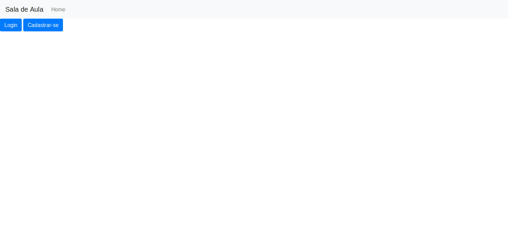
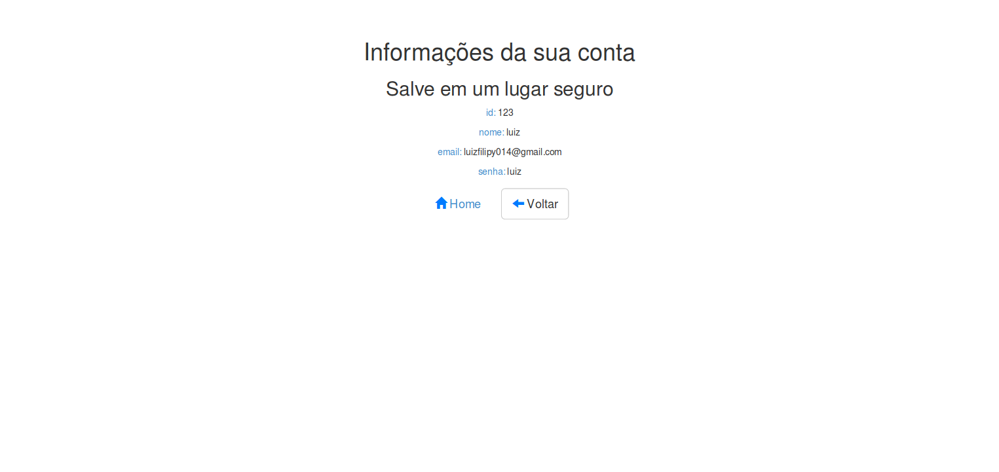
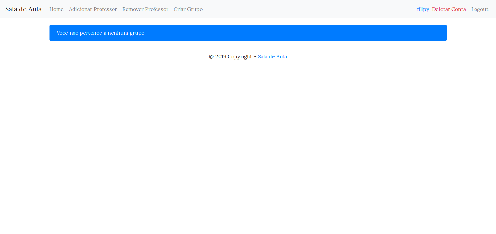
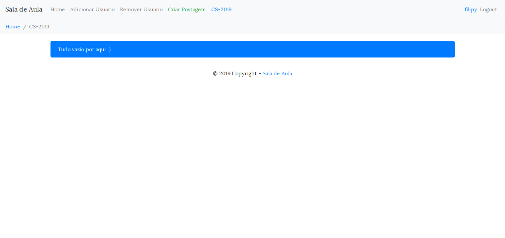
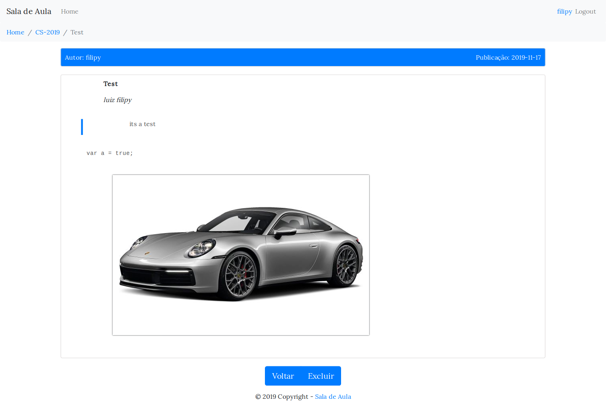

# Sala_de_aula
Uma sala de aula virtual

##### home

##### home

##### dash

##### group view

##### post

## Opcoes

#### Usuário comum
* Criar postagens

#### Professor
* Criar Grupos
* Adicionar/Remover Usuários dos grupos

#### Admin
* Transformar usuários comuns em professores

> Meu primeiro projeto em NodeJS
